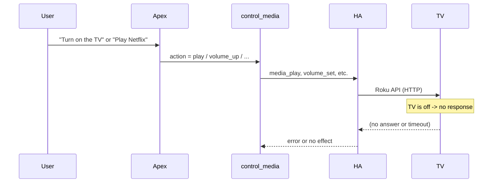

# Roku / TCL TV not controllable when off

## Why it happens

**1. TV / network behavior**

Roku TVs (including TCL with Roku) often enter a **low-power standby** when “off.” In that state they can stop responding to:

- Home Assistant’s Roku integration (HTTP/ECP)
- Wake-on-LAN (many Roku TVs don’t support or honor WoL reliably)

So when the TV is off, HA (and thus Apex Brain) has nothing to talk to until the TV is woken by something else (remote, CEC, or a TV-side setting that keeps the network up).

**2. Apex Brain cannot turn the TV on**

Control flows like this:

In [apex_brain/tools/smart_home.py](apex_brain/tools/smart_home.py), `control_media` only supports: `play`, `pause`, `stop`, `next`, `previous`, `volume_up`, `volume_down`, `mute`, `unmute`. There is **no `turn_on` or `turn_off**`. So the assistant cannot power the TV on before sending play/volume/source. It can use `call_service(domain="media_player", service="turn_on", entity_id=...)`, but the system prompt directs TVs to `control_media` and does not tell the model to call `turn_on` first when the TV might be off.

So even when the TV *could* be woken by HA’s `media_player.turn_on`, the assistant is not guided to use it for “turn on the TV” or “play on the TV” when the TV is off.

---

## What to do

### A. TV and Home Assistant setup (no code changes)

- **Static IP** for the Roku/TCL TV so HA always talks to the same host.
- **Roku:** Settings → System → Advanced → **Control by mobile apps** → **Network access** = On.
- **Fast TV Start (Roku):** Settings → System → Power → **Fast TV Start**.  
  - When enabled, the TV can keep network connectivity in standby (so HA can wake it).  
  - If the TV still doesn’t wake reliably, some users report improvement by **disabling** Fast TV Start (firmware/behavior varies). Try enable first; if control when “off” is still missing, try disable.
- In HA, ensure the **Roku** integration is set up and the entity is a `media_player` (and optionally a `remote`) so `media_player.turn_on` is available.

These steps maximize the chance that when Apex (or HA) sends “turn on,” the TV is reachable and can wake.

### B. Code: Add power on/off to `control_media` (recommended)

- **File:** [apex_brain/tools/smart_home.py](apex_brain/tools/smart_home.py)
- **Change:** Extend the `control_media` tool:
  - Add to the `action` enum: `turn_on` and `turn_off`.
  - In the implementation, map `turn_on` → `media_player.turn_on`, `turn_off` → `media_player.turn_off` via `_call_ha_service("media_player", "turn_on" | "turn_off", entity_id)` (no extra payload for basic on/off).
- **Result:** The assistant can respond to “turn on the living room TV” or “turn off the TV” with `control_media(entity_id, "turn_on")` / `control_media(entity_id, "turn_off")`, and can **turn on first** then play/volume when the user says e.g. “play something on the TV” and the TV is off.

### C. System prompt (optional but helpful)

- **File:** [apex_brain/brain/system_prompt.py](apex_brain/brain/system_prompt.py)
- **Change:** In the SMART HOME bullet for media, add a short line: for TVs that may be off, turn on first with `control_media` action `turn_on` before play/volume/source. This encourages the model to power the TV on when the user intent implies using the TV.

### D. Documentation

- Add a short doc (e.g. `docs/roku-tcl-tv-when-off.md`) that:
  - Explains that Roku/TCL TVs in standby often don’t respond to network/HA.
  - Lists the TV/HA steps above (static IP, Network access, Fast TV Start, Roku integration).
  - Notes that Apex can turn the TV on via `control_media` with action `turn_on` (after B is implemented).

---

## Summary

| Cause                                     | Mitigation                                                                                                       |
| ----------------------------------------- | ---------------------------------------------------------------------------------------------------------------- |
| TV in deep standby, not answering network | Static IP, enable Network access, try Fast TV Start on or off                                                    |
| Assistant can’t send “turn on”            | Add `turn_on` / `turn_off` to `control_media`; optionally prompt the model to turn on the TV first when relevant |

No changes to the Roku or Home Assistant integrations themselves are required; the fix is TV/network configuration plus exposing and using `media_player.turn_on` / `turn_off` from Apex Brain.