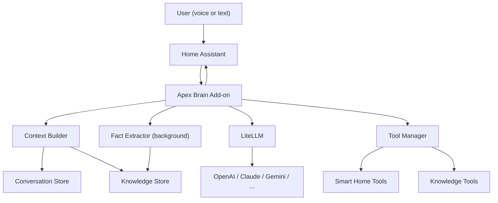

# Apex Brain

Personal AI assistant with **persistent memory**, smart home control, and semantic knowledge. Runs as a Home Assistant Add-on on your HAOS mini PC (24/7). Unlike HA's built-in stateless AI, Apex remembers every conversation, auto-learns about you, and recalls facts semantically—so "what was I eating?" finds "had sushi at Tanaka" without exact keywords.

---

## Features

- **Persistent memory**: Every conversation is saved. Background fact extraction learns preferences, people, events, and habits automatically.
- **Semantic recall**: Embeddings + cosine similarity. Ask in natural language; Apex finds relevant stored facts.
- **Smart home control**: Full Home Assistant REST API—lights, climate, locks, media, areas. Auto-authenticated when running as an add-on.
- **Swap AI models in seconds**: One config string. GPT-4o, Claude, Gemini, Grok, local Ollama—any model [LiteLLM](https://docs.litellm.ai/docs/providers) supports.
- **OpenAI-compatible API**: Works with HA's Extended OpenAI Conversation integration. No custom HA code.
- **Decorator-based tools**: Add a new capability by dropping one `.py` file. Auto-discovered on restart.

---

## Architecture



- **brain/**: FastAPI server (`/v1/chat/completions`, `/api/chat`, `/health`), conversation orchestrator, config, dynamic system prompt.
- **memory/**: Conversation store (SQLite), knowledge store (facts + embeddings, numpy cosine search), fact extractor (background LLM), context builder (injects time + recent turns + relevant facts into every request).
- **tools/**: Smart home (HA API), knowledge (remember/recall/forget), datetime, calendar stub. Decorator-based, auto-discovered.
- **ha_addon/**: Dockerfile, config.yaml, run.sh for HA Supervisor deployment.

---

## Project Structure

```
apex/
├── brain/
│   ├── server.py          # FastAPI app, lifespan, endpoints
│   ├── conversation.py    # Orchestrator: context → AI → tool loop → response
│   ├── config.py          # Pydantic Settings (env vars)
│   └── system_prompt.py   # Dynamic prompt with injected context
├── memory/
│   ├── conversation_store.py   # Saves every turn (SQLite)
│   ├── knowledge_store.py      # Facts + embeddings, semantic search
│   ├── fact_extractor.py       # Background fact extraction (cheap model)
│   └── context_builder.py      # Builds context before each AI call
├── tools/
│   ├── base.py            # @tool decorator, TOOL_REGISTRY, execute_tool
│   ├── smart_home.py      # list_entities, get_entity_state, call_service, get_areas
│   ├── knowledge.py       # remember, recall, forget
│   ├── datetime_tool.py   # get_current_datetime
│   └── calendar_tool.py   # Stub (Google Calendar, enable when ready)
├── ha_addon/
│   ├── config.yaml        # Add-on metadata, options schema
│   ├── Dockerfile         # Python 3.12, HA-compatible base
│   └── run.sh             # Reads options.json, starts uvicorn
├── repository.yaml        # Required for HA add-on repository discovery
├── requirements.txt
├── .env.example
└── README.md
```

---

## Setup

### 1. Local development (no HA required)

Run Apex on your machine to test memory, tools, and API.

```bash
cd apex
pip install -r requirements.txt
cp .env.example .env
# Edit .env: set OPENAI_API_KEY, optionally HA_URL + HA_TOKEN for smart home
python -m brain.server
```

**Test:**

```bash
curl http://localhost:8080/health
curl -X POST http://localhost:8080/api/chat -H "Content-Type: application/json" -d '{"message": "Hello Apex"}'
```

### 2. Install HACS (if you don’t have it)

Required for the Extended OpenAI Conversation integration.

1. In HA: **Settings → Add-ons → Add-on Store**. Install the **SSH & Web Terminal** add-on (or any SSH add-on). Enable **Advanced Mode** in your user profile if you don’t see it.
2. Configure and start the SSH add-on, then connect (e.g. from Terminal).
3. Run:
   ```bash
   wget -O - https://get.hacs.xyz | bash -
   ```
4. Restart Home Assistant.
5. **Settings → Devices & Services → Add Integration**. Search for **HACS**, add it, and authorize with your GitHub account.

Ref: [HACS setup](https://hacs.xyz/docs/setup/download/)

### 3. Install and configure the Apex Brain add-on

1. **Settings → Add-ons → Add-on Store**. Click the **⋮** (three dots) → **Repositories**.
2. Add repository URL: `https://github.com/SalihTalhaAydin/A.P.E.X.`
3. Refresh. Find **Apex Brain** in the store and install it.
4. Open **Apex Brain** → **Configuration**. Set:
   - `litellm_model` (e.g. `gpt-4o`)
   - `openai_api_key` and/or `anthropic_api_key` as needed
5. **Start** the add-on. Check **Log** to confirm it’s listening on port 8080.

### 4. Install Extended OpenAI Conversation and point it at Apex

1. In HACS: **Integrations → Explore & Download**. Search for **Extended OpenAI Conversation**, install, restart HA.
2. **Settings → Devices & Services → Add Integration**. Search **Extended OpenAI Conversation**.
3. When prompted:
   - **API Key**: use any placeholder (e.g. `apex`); Apex doesn’t validate it.
   - **Base URL**: `http://homeassistant:8080/v1`  
     (If that hostname fails, try `http://apex_brain:8080/v1` or the add-on’s actual hostname from the add-on docs.)
4. Complete the integration setup.

Ref: [Extended OpenAI Conversation](https://github.com/jekalmin/extended_openai_conversation)

### 5. Create a voice assistant pipeline

1. **Settings → Voice Assistants → Add** (or edit an existing assistant).
2. **Conversation agent**: choose the **Extended OpenAI Conversation** agent you just configured (the one pointing at Apex).
3. **Speech-to-text**: e.g. Whisper (local) or your preferred STT.
4. **Text-to-speech**: e.g. Piper (local) or your preferred TTS.
5. Save. You can now use this pipeline from the HA Companion App (Assist button) or from supported voice devices.

### 6. Wake word (Voice PE devices)

If you use Home Assistant Voice PE hardware:

1. **Settings → Devices & Services → ESPHome**. Select your **Home Assistant Voice** device.
2. On the device page, under **Configuration**, choose the **Wake word** (e.g. **Hey Jarvis** or **Okay Nabu**).  
   A custom **Hey Apex** wake word would require training your own openWakeWord model; until then, use a built-in option.

Ref: [Voice PE wake word](https://voice-pe.home-assistant.io/guides/wake_word_change/)

### 7. Test without Voice PE (phone or browser)

- **HA Companion App**: Open Assist (microphone or keyboard), speak or type. Requests go through your pipeline to Apex.
- **HA frontend**: Use the Assist bubble and type or use the mic (if your browser allows).

---

## Configuration

### Environment variables (local) / Add-on options (HA)

| Variable | Description | Example |
|----------|-------------|---------|
| `LITELLM_MODEL` | Chat model | `gpt-4o`, `claude-sonnet-4-20250514`, `gemini/gemini-2.0-flash` |
| `OPENAI_API_KEY` | OpenAI API key | Required for OpenAI/GPT models |
| `ANTHROPIC_API_KEY` | Anthropic API key | Required for Claude models |
| `EMBEDDING_MODEL` | Model for semantic memory | `text-embedding-3-small` |
| `FACT_EXTRACTION_MODEL` | Model for background fact extraction | `gpt-4o-mini` |
| `HA_URL` | Home Assistant URL (local dev) | `http://192.168.1.100:8123` |
| `HA_TOKEN` | Long-lived access token (local dev) | From HA Profile → Security |
| `DB_PATH` | SQLite database path | `./apex.db` (local), `/data/apex.db` (add-on) |

### Swapping AI models

Change `LITELLM_MODEL` in `.env` (local) or in the add-on Configuration (HA). Restart the server/add-on. Examples:

- **OpenAI**: `gpt-4o`, `gpt-4o-mini`, `gpt-4-turbo`, `gpt-5-pro`
- **Anthropic**: `claude-sonnet-4-20250514`, `claude-opus-4-20250514`
- **Google**: `gemini/gemini-2.0-flash`, `gemini/gemini-2.5-flash`
- **xAI**: `grok/grok-2`, `grok/grok-3-1212`
- **Local**: `ollama/llama3.2`

Full list: [LiteLLM providers and models](https://docs.litellm.ai/docs/providers)

---

## Adding new tools

Create a new file under `tools/` and use the `@tool` decorator. The function is auto-discovered on server restart.

```python
# tools/weather.py
from tools.base import tool

@tool(description="Get current weather for a location")
async def get_weather(location: str) -> str:
    # Your implementation (e.g. call an API)
    return "72°F and sunny in " + location
```

Restart Apex. The new tool is available to the model.

---

## Roadmap

- **Phase 2 (current)**: Brain + memory + smart home + knowledge + datetime; HA add-on; voice via Extended OpenAI Conversation.
- **Phase 3**: Email (Gmail/Outlook), calendar (Google), PC control (optional agent on Windows), web search; iPhone notifications via HA Companion.
- **Later**: Custom “Hey Apex” openWakeWord model; ATOM Echo (or similar) mic satellites with speaker routing per room; optional HA AI Task integration for camera/image analysis.

---

## License and repo

- **Repository**: [github.com/SalihTalhaAydin/A.P.E.X.](https://github.com/SalihTalhaAydin/A.P.E.X.)
- Add-on repository URL for HA: `https://github.com/SalihTalhaAydin/A.P.E.X.`
